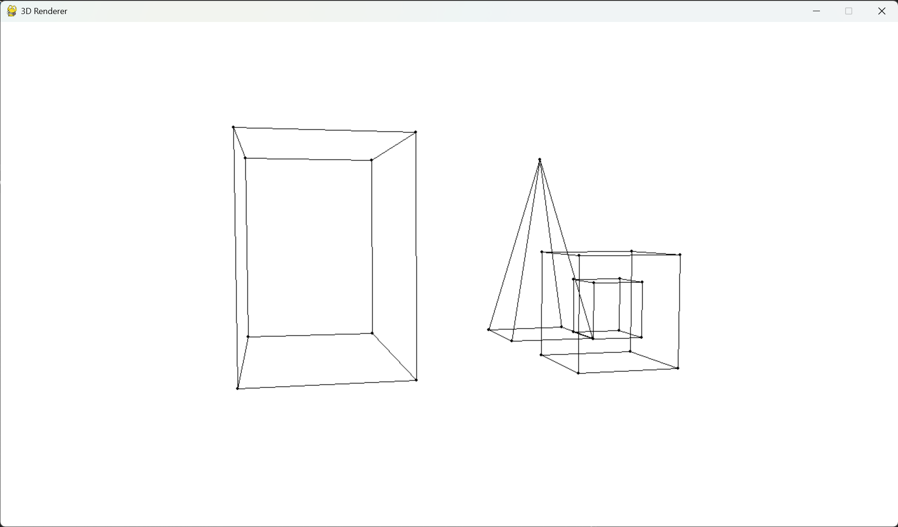

<p align="center"></p>

<h1 align="center">3D Renderer</h1>

<h3 align="center"><b>A simple 3D renderer that allows you to move around the scene using the keys.</b></h3>

<p align="center">3D Renderer was written using Python and PyGame library. This project was part of "Computer Graphics" course at Warsaw University of Technology.</p>

<p align="center"></p>

---

## Support status

> [!IMPORTANT]  
> App is no longer maintained, but should work properly

## Features

- Create your own scene
- Move around the scene using the keys

## Installation

Download latest package version from <a href="https://repos.mateuszskoczek.com/MateuszSkoczek/3DRenderer/releases">Releases</a> tab, unpack, install requirements and you good to go

**Requirements**

- Python installed
- PIP packages:
    - `pygame`
    - `numpy`

You can also use `requirements.txt` file to install PIP dependencies

```
pip install -r requirements.txt
```

## Usage

```
python 3d_renderer
```

**Create the scene:**

You can define your own scene in `main` method of `App` class in `3d_renderer/app.py` file.

- Create object builder: `obj_builder1 = ObjectBuilder()`
- Add as many vertices to the object as you want: `va = obj_builder1.add_vertex(-1, 1,  1)`
- Connect vertices to make edges: `obj_builder1.add_vertices_connection(va, vb)`
- Build object and add it to the scene: `self.renderer.add_object(obj_builder1.build())`

**Controls:**

- <kbd>W</kbd> - move forward
- <kbd>S</kbd> - move backward
- <kbd>A</kbd> - move left
- <kbd>D</kbd> - move right
- <kbd>Space</kbd> - move up
- <kbd>LShift</kbd> - move down
- <kbd>=</kbd> - FOV up
- <kbd>-</kbd> - FOV down
- <kbd>F</kbd> - Pitch up
- <kbd>R</kbd> - Pitch down
- <kbd>E</kbd> - Yaw up
- <kbd>Q</kbd> - Yaw down
- <kbd>C</kbd> - Roll up
- <kbd>Z</kbd> - Roll down

## Attribution

You can copy this repository and create your own version of the app freely. However, it would be nice if you included this repository in the description to your repository or in README file.

**Other sources:**

- Icon by <a href="icons8.com">Icons8</a>